# 高校课程评价与管理系统（Django）

本项目为高校课程评价与管理系统，基于 Django 构建，包含学生端、教师端、管理员端三类角色，实现课程管理、选课、课表可视化、成绩录入与查询、课程评价与结果统计、教师人气排行榜等功能。

## 功能概览

- 统一登录入口：按角色自动跳转至对应仪表盘
- 学生端：选课（按学期筛选）、课表可视化、成绩查询与 CSV 导出、课程评价、历史评价记录、教师投票
- 教师端：授课课程列表、成绩权重设置与成绩录入、课程评价结果查看
- 管理员端：后台维护用户/课程/问卷模板/评价任务等基础数据
- 教师排行榜：Chart.js 可视化展示得票统计（支持导出 CSV）

## 页面截图

<details>
<summary>登录与仪表盘</summary>

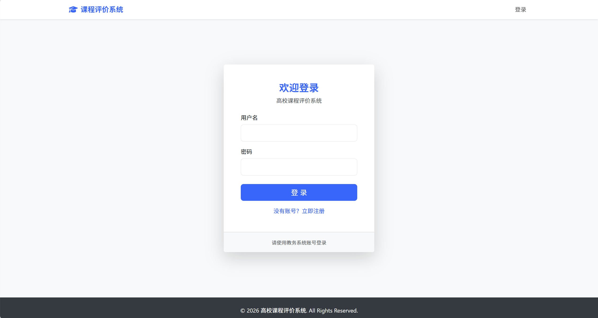
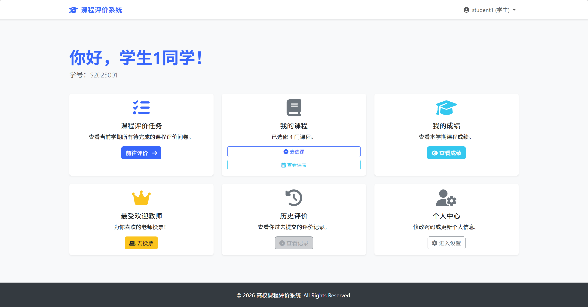
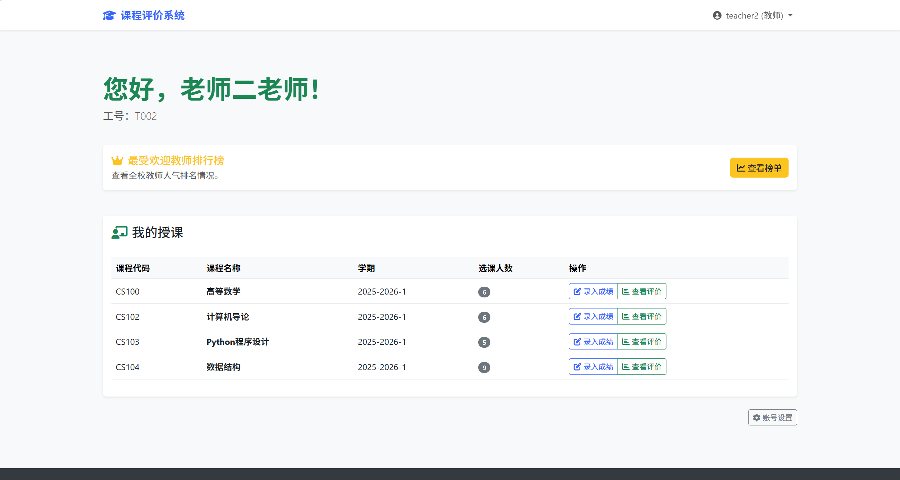
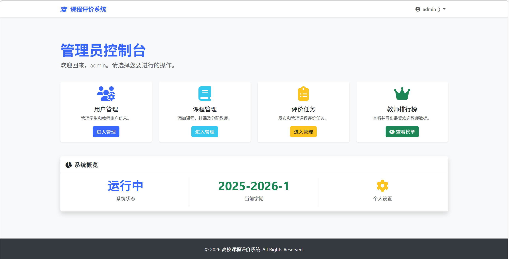

</details>

<details>
<summary>学生端功能</summary>

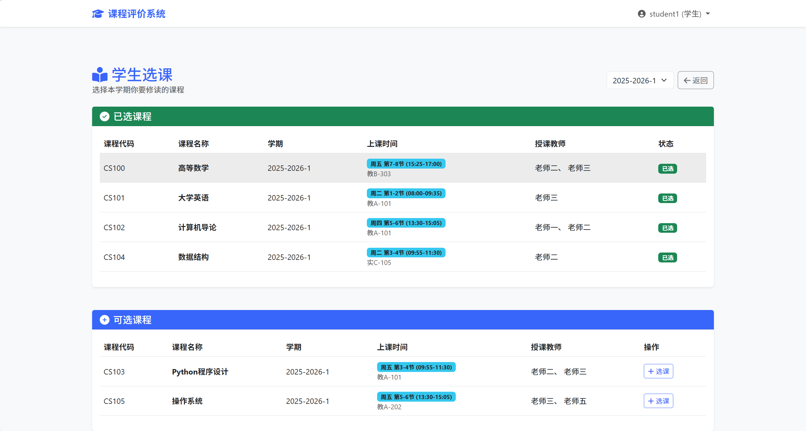
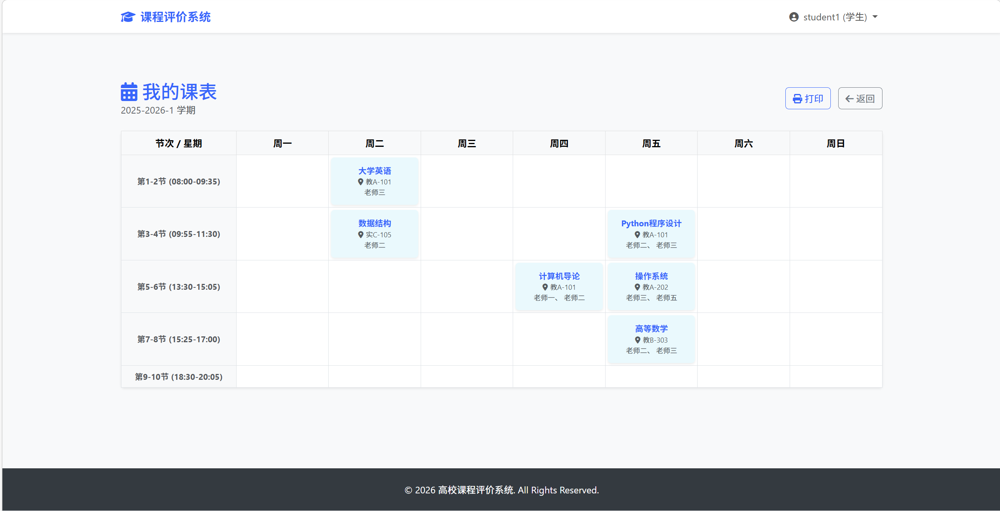
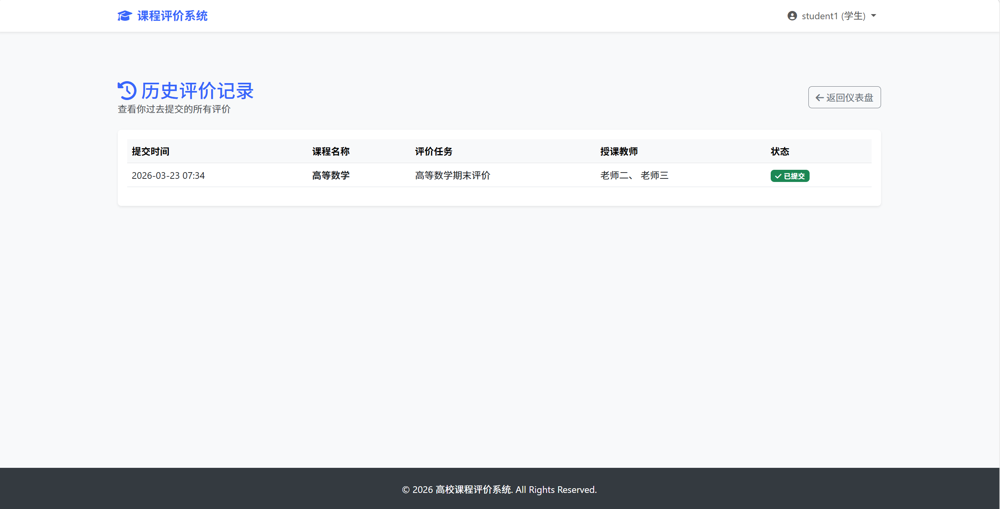
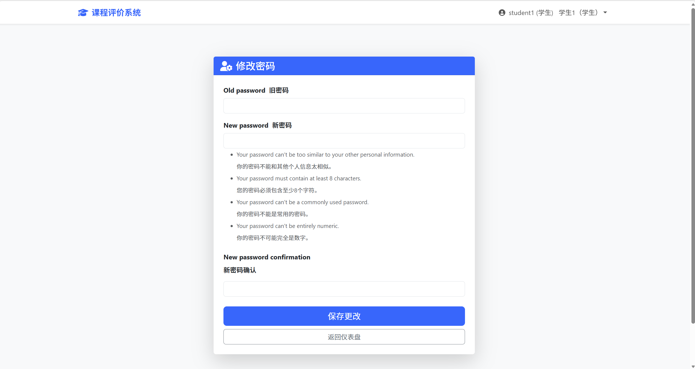
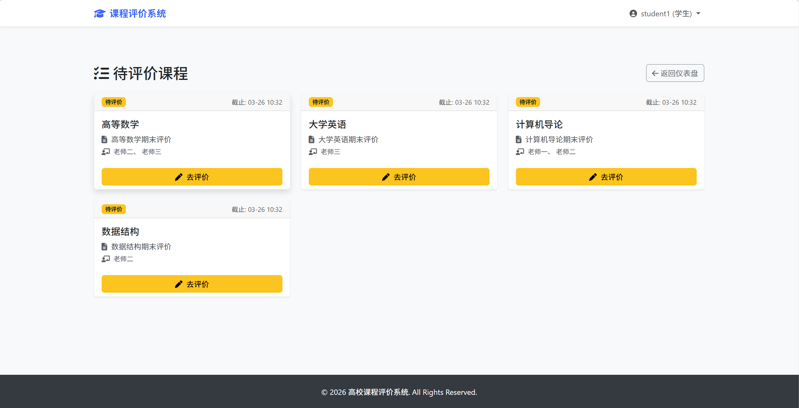
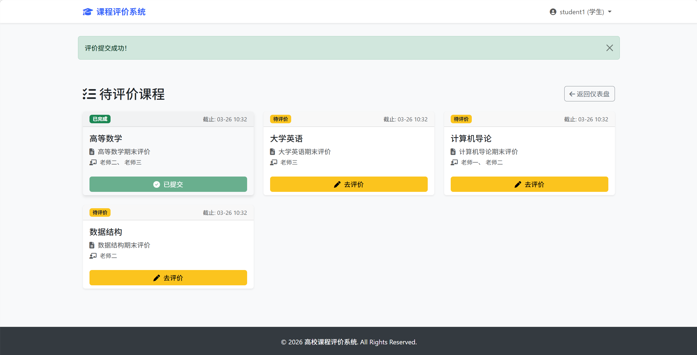
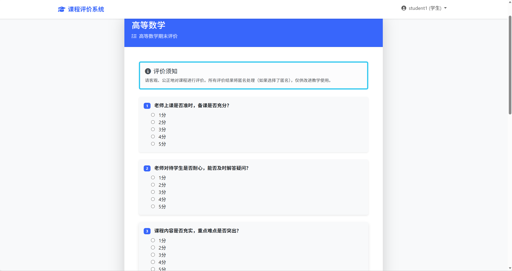
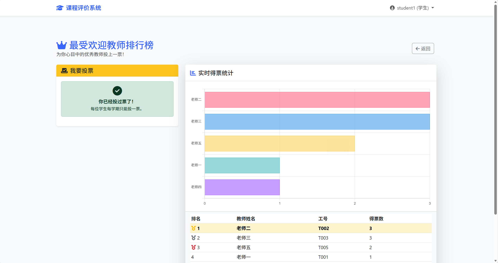

</details>

<details>
<summary>教师端功能</summary>

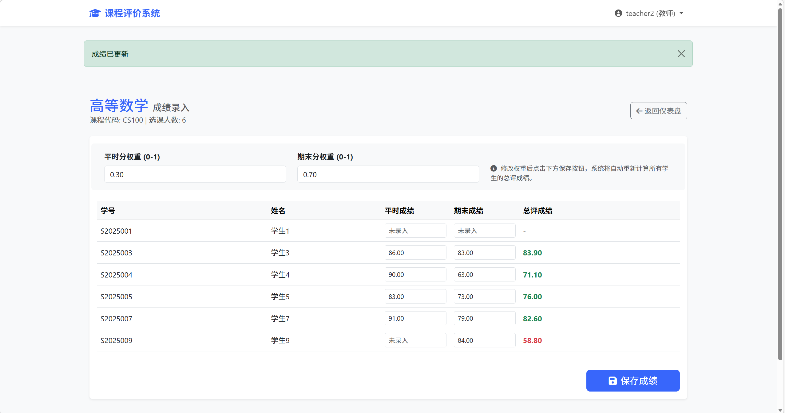
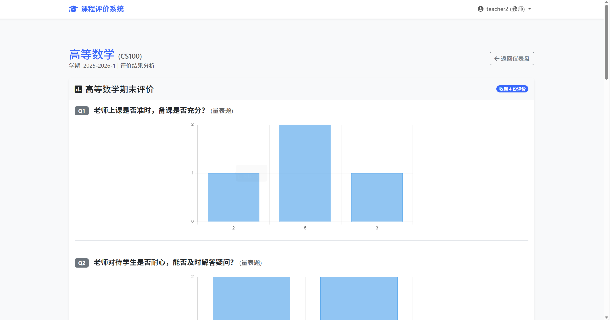
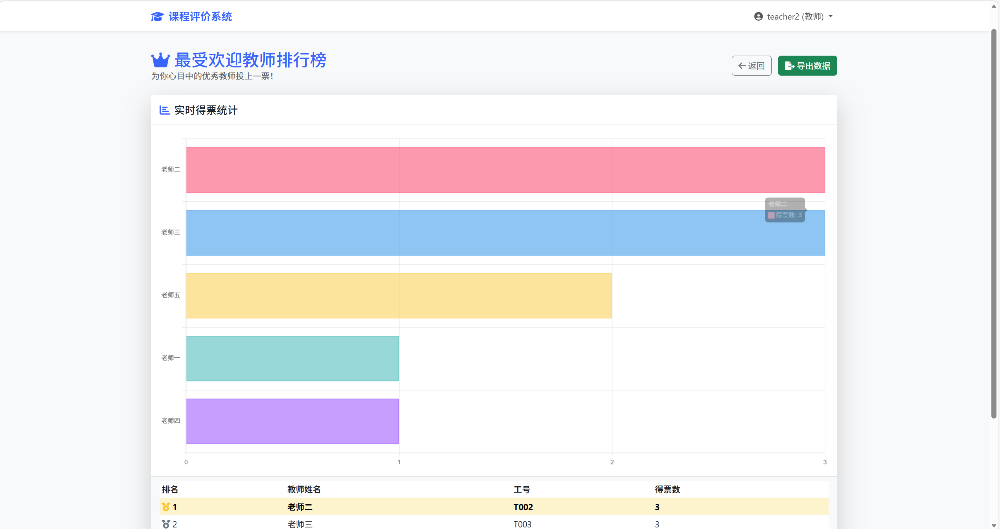

</details>

<details>
<summary>管理员端功能</summary>

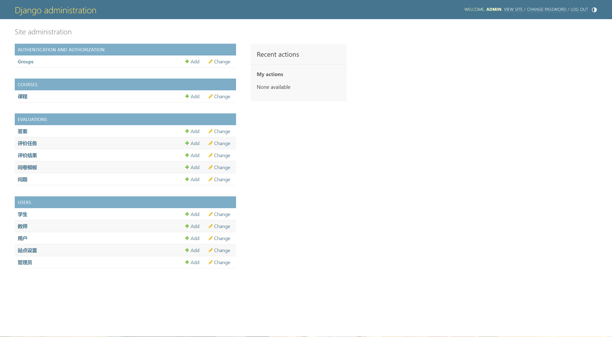


</details>


## 技术栈

- 登录与页面样式：Bootstrap 5（栅格、卡片、按钮、表单、徽章等）
- 图标：FontAwesome
- 图表：Chart.js（评价统计、排行榜）
- 模板继承：base.html 统一导航与布局，子页 extends 复用

## 页面实现说明

以下为关键页面所用组件与实现要点，便于二次开发者快速定位代码与扩展。

- 登录页（templates/registration/login.html）
  - 组件：Bootstrap Card、Form、Alert；表单字段 username/password。
  - 认证：使用 Django 自带认证路由 `/accounts/login/`；成功后跳转 `/dashboard/`。
  - 扩展点：在页脚增加注册入口（/register/）。

- 注册页（templates/registration/register.html）
  - 组件：Bootstrap Card、Form；字段 username/student_id/name/password1/password2。
  - 表单与校验：users.views.RegisterForm（用户名/学号唯一、双重密码一致）。
  - 创建逻辑：创建 User(user_type=student) + Student 扩展，并自动登录。
  - 开关控制：users.models.SiteSetting.registration_enabled；管理员在 Admin 后台可随时关闭注册。

- 学生仪表盘（templates/student_dashboard.html）
  - 组件：Card、栅格、快捷按钮。
  - 数据来源：users.views.dashboard（user_type=student 分支）。

- 学生选课（templates/select_courses.html）
  - 组件：表单筛选（学期）、表格/按钮、已选/可选分区。
  - 逻辑：evaluations.views_student.select_courses/enroll_course；基于 Course 与学生多对多关系。

- 我的课表（templates/student_schedule.html）
  - 组件：Bootstrap 栅格 + 自定义二维表样式；打印友好样式。
  - 数据来源：Course 的 week_day/time_slot/location 字段；views_student.student_schedule。

- 历史评价记录（templates/historical_evaluations.html）
  - 组件：ListGroup/表格。
  - 数据来源：EvaluationResult 与任务/课程关联；views_student.historical_evaluations。

- 成绩查询（templates/my_grades.html）
  - 组件：筛选下拉、表格、导出按钮（CSV）。
  - 逻辑：views_student.my_grades；评分导出按区间映射绩点（内置）。

- 教师仪表盘（templates/teacher_dashboard.html）
  - 组件：Card 列表（课程）、操作按钮（录入成绩/查看评价）。
  - 数据来源：users.views.dashboard（user_type=teacher 分支）。

- 录入成绩（templates/course_grading.html）
  - 组件：表单（权重）、学生成绩录入表格。
  - 逻辑：views_teacher.course_grading；Score.save() 自动按权重计算总评。

- 查看评价（templates/course_results.html）
  - 组件：Chart.js 柱状图（选择题分布）、列表（文本题反馈）。
  - 数据来源：views_teacher.course_results 生成 labels_json/data_json。

- 教师排行榜（templates/teacher_leaderboard.html）
  - 组件：Chart.js 图表 + 表格；导出 CSV。
  - 逻辑：views_student.teacher_leaderboard/export_teacher_votes。

- 管理员仪表盘（templates/admin_dashboard.html）
  - 组件：Card 宫格、系统概览。
  - 统一样式：继承 base.html；CDN 失败时自动切换至国内镜像（见 base.html）。

## 目录结构

- users：用户、学生/教师/管理员扩展信息与仪表盘
- courses：课程与成绩模型
- evaluations：问卷模板、评价任务、评价结果、投票、选课/课表/成绩查询等业务
- templates：系统页面模板

## 本地运行

### 1. 创建虚拟环境并安装依赖

```bash
python -m venv venv
.\venv\Scripts\activate
pip install -r requirements.txt
```

### 2. 配置环境变量（可选但推荐）

项目使用环境变量读取 `DJANGO_SECRET_KEY` 与 `DJANGO_DEBUG`。仓库中提供了 `.env.example` 作为参考，但默认不会自动加载 `.env` 文件，你可以在启动前手动设置环境变量。

PowerShell 示例：

```powershell
$env:DJANGO_SECRET_KEY="change-me"
$env:DJANGO_DEBUG="true"
```

### 3. 数据库迁移与启动

```bash
python manage.py migrate
python manage.py runserver
```

访问：
- 登录页：`http://127.0.0.1:8000/accounts/login/`
- 管理后台：`http://127.0.0.1:8000/admin/`

### 4. 创建管理员账号（可选）

```bash
python manage.py createsuperuser
```

### 5. 生成示例数据（可选）

项目内置数据填充命令：

```bash
python manage.py populate_data
```

## 常用功能入口

- 仪表盘：`/dashboard/`
- 学生任务：`/tasks/`
- 选课：`/select-courses/`
- 课表：`/schedule/`
- 成绩：`/my-grades/`
- 教师排行榜：`/teacher-leaderboard/`

## 注意事项

- 默认使用 SQLite，本地开发无需额外安装数据库。


## 连接到你自己的 MySQL

通过环境变量切换：
- `DB_ENGINE`：`sqlite` 或 `mysql`（默认 sqlite）
- `DB_NAME`：数据库名（如 `course_evaluation`）
- `DB_USER`：数据库用户名（如 `ce_user`）
- `DB_PASSWORD`：数据库密码
- `DB_HOST`：主机（默认 `127.0.0.1`）
- `DB_PORT`：端口（一般默认 `3306`）

> 项目不会自动加载 `.env`，请在终端设置环境变量或在部署环境中配置。

### Windows PowerShell 示例

```powershell
$env:DB_ENGINE="mysql"
$env:DB_NAME="course_evaluation"
$env:DB_USER="ce_user"
$env:DB_PASSWORD="123456"
$env:DB_HOST="127.0.0.1"
$env:DB_PORT="3308"  # 若为默认3306可省略

python manage.py migrate
python manage.py runserver
```

### Linux/macOS 示例

```bash
export DB_ENGINE=mysql
export DB_NAME=course_evaluation
export DB_USER=ce_user
export DB_PASSWORD=123456
export DB_HOST=127.0.0.1
export DB_PORT=3308

python manage.py migrate
python manage.py runserver
```

### 初始化 MySQL（只需一次）

```sql
CREATE DATABASE IF NOT EXISTS course_evaluation
  DEFAULT CHARACTER SET utf8mb4
  DEFAULT COLLATE utf8mb4_unicode_ci;

CREATE USER IF NOT EXISTS 'ce_user'@'%' IDENTIFIED BY '123456';
GRANT ALL PRIVILEGES ON course_evaluation.* TO 'ce_user'@'%';
FLUSH PRIVILEGES;
```

## 从 SQLite 迁移数据到 MySQL

1. 使用 SQLite 导出数据（使用 `--output` 确保 UTF‑8）：
   ```powershell
   $env:DB_ENGINE="sqlite"
   python manage.py dumpdata --exclude contenttypes --exclude auth.permission --indent 2 --output data.json
   ```


2. 切换 MySQL 并迁移表结构：
   ```powershell
   $env:DB_ENGINE="mysql"
   $env:DB_NAME="course_evaluation"
   $env:DB_USER="ce_user"
   $env:DB_PASSWORD="123456"
   $env:DB_HOST="127.0.0.1"
   $env:DB_PORT="3308"
   python manage.py migrate
   ```
3. 导入数据：
   ```powershell
   python manage.py loaddata data.json
   ```

如果 `loaddata` UTF‑8 解码错误，先转换为 UTF‑8 再导入。

```powershell
python - <<'PY'
import pathlib, json, sys
p = pathlib.Path('data.json'); b = p.read_bytes()
for enc in ('utf-8','utf-8-sig','utf-16','utf-16le','utf-16be','gbk','cp936','latin1'):
    try:
        s = b.decode(enc); obj = json.loads(s)
        pathlib.Path('data_utf8.json').write_text(json.dumps(obj, ensure_ascii=False, indent=2), encoding='utf-8')
        print('detected', enc); sys.exit(0)
    except Exception: pass
print('failed: unknown encoding', file=sys.stderr); sys.exit(1)
PY
python manage.py loaddata data_utf8.json
```
